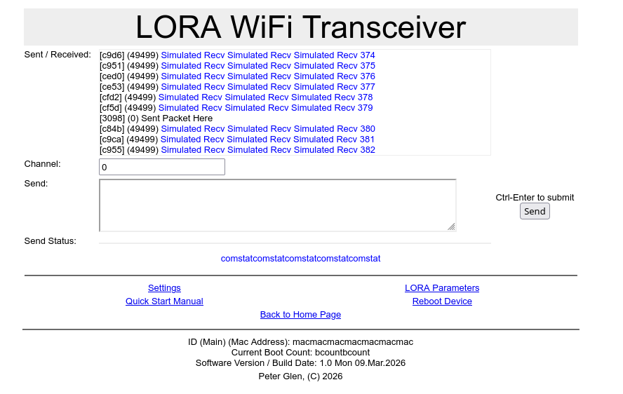

# LoraWiFi

## Compile / build requirements

The project is developed with ESP-IDF 5.5. Can be downloaded from espressif's
web site.

Additionally:

    m4      macro processor
    make    make utility

These are available with all platforms / distros, and most likely are
already installed.

### Configure the project

  Open the project configuration menu ('idf.py menuconfig') or 'make menuconfig'
The LORA configuration is under / Component config / LoRa Configuration
The web configuratio is under

### Build and Flash

Execute the  ./convpages.sh to generate the pages from the m4 macros.
Executer the ./genpages.sh to generate headers from html.

Build the project and flash it to the board, then run the monitor tool to
view the serial output:

Run `idf.py -p PORT flash monitor` to build, flash and monitor the project.
You can use the 'make' command to do
(To exit the serial monitor, type ``Ctrl-]``.)

See the Getting Started Guide for all the steps to configure and use the
ESP-IDF to build projects.

## Screen shot of home page

## Command line interface

    Commands: v (verbose) [1-10]; h (help); o (reboot);
              w (pw) set power level. [2-15]
              s (sf) set spread factor. [6-12]
              b (bw) set bandwidth. [5-500]
              f (fr) set frequency. [410.0-530.0] (Clamped to legal limits)
              x (rx) RX offset frequency in +-Hz.
              j (pj) ppm adjustment (+-0x7f)
              d (de) set defaults. [fr=433.375 bw=50 sf=10 pw=12]
              t (tr) transmit string
              e (ep) repeat transmit string
              r (re) set trench number
              p (pr) print current and default configuration
              m (du) dump persistent data.
              c (cl) clear persistent data.
    Use: 'command ?' for help on a particular command.

// EOF
